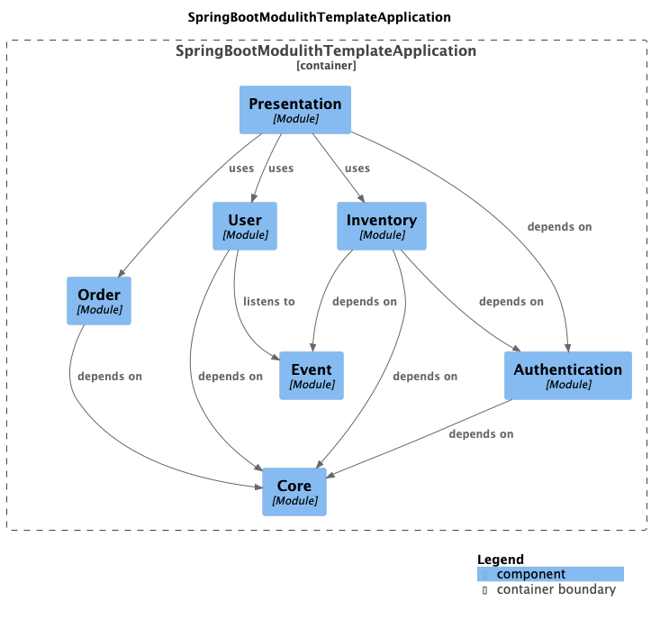

# Kotlin Spring Modulith Example

A sample project demonstrating **modular monolith architecture** using Spring Modulith with Kotlin, showcasing how to
build well-structured, maintainable applications with enforced module boundaries.

## Overview

This project demonstrates Spring Modulith's ability to enforce architectural boundaries within a monolithic application.
Unlike traditional monoliths where any code can call any other code, Spring Modulith allows you to define clear module
boundaries and dependencies, making your codebase more maintainable and easier to understand.

### Key Features

- **Enforced Module Boundaries**: Spring Modulith verifies module dependencies at test time
- **Event-Driven Architecture**: Decoupled inter-module communication using Spring's event system
- **Presentation Layer Pattern**: Aggregation layer that combines data from multiple modules
- **Cross-Cutting Concerns with AOP**: Authentication aspect demonstrates module interaction patterns
- **Automatic Documentation Generation**: Generates module diagrams and documentation
- **Kotlin-First**: Built with Kotlin 2.2.21 and leverages Kotlin features
- **Modern Spring**: Uses Spring Boot 4.0.0-M2 with virtual threads enabled

## Architecture

### Module Structure

The application consists of seven modules with explicit dependencies:


```
core (shared utilities)
  ↑
  ├── authentication (AOP aspects, annotations)
  ├── event (OPEN module for event definitions)
  ├── order (order management)
  │     ↑
  ├── inventory (stock management)
  │     ↑ (depends on core, authentication, and event)
  ├── user (user management)
  │     ↑ (depends on core and event)
  │
  └── presentation (aggregation layer)
        ↑ (depends on inventory, order, user, authentication, and core)
```

Each module is defined by:

1. A package under `org.github.swszz.<module-name>`
2. A `@ApplicationModule` class declaring allowed dependencies
3. Module-specific services, repositories, and controllers

### Module Descriptions

- **core**: Base module providing shared utilities (e.g., `Logger`, `KafkaConfiguration`)
- **authentication**: Provides `@Authentication` annotation and AOP aspect for cross-cutting authentication concerns
- **event**: OPEN module containing shared event definitions for inter-module communication (e.g.,
  `InventoryAccessEvent`)
- **order**: Order management functionality
- **inventory**: Inventory management with authentication integration, publishes events when accessed
- **user**: User management functionality, can listen to events from other modules
- **presentation**: Aggregation layer that combines data from multiple modules and exposes unified REST API endpoints

### Database Design

- Single H2 in-memory database (`coredb`)
- Module-specific schema files: `schema-order.sql` and `schema-inventory.sql`
- Tables are logically grouped by module but share the same database

## Prerequisites

### Java

- **Java 24** (configured via Gradle toolchain)

### macOS Setup

Install required dependencies using Homebrew:

```bash
brew install libtool
brew link libtool
brew install graphviz
brew link --overwrite graphviz
```

Note: Graphviz is required for generating module documentation diagrams.

## Getting Started

### Build the Project

```bash
./gradlew build
```

### Run Tests

```bash
# Run all tests
./gradlew test

# Run a specific test
./gradlew test --tests "org.github.swszz.ApplicationTests"
```

### Run the Application

```bash
./gradlew bootRun
```

The application will start on `http://localhost:8080`

### Access H2 Console

Visit `http://localhost:8080/h2-console` with the following credentials:

- **JDBC URL**: `jdbc:h2:mem:coredb`
- **Username**: `sa`
- **Password**: (leave empty)

## API Endpoints

### Dashboard API (Presentation Module)

The presentation module provides a unified API that aggregates data from multiple modules:

**GET /api/dashboard**

- Returns a comprehensive dashboard with order, inventory, and user information
- Protected by `@Authentication` aspect
- Response includes:
    - Total number of orders
    - Total number of inventory items
    - List of order summaries
    - List of inventory summaries
    - User information
    - Authentication status

**Example:**

```bash
curl http://localhost:8080/api/dashboard
```

**Response:**

```json
{
  "totalOrders": 2,
  "totalInventoryItems": 3,
  "orders": [
    {
      "id": 1,
      "productName": "Product A",
      "quantity": 10
    },
    {
      "id": 2,
      "productName": "Product B",
      "quantity": 5
    }
  ],
  "inventories": [
    {
      "id": 1,
      "productName": "Product A",
      "stockQuantity": 100
    },
    {
      "id": 2,
      "productName": "Product B",
      "stockQuantity": 50
    },
    {
      "id": 3,
      "productName": "Product C",
      "stockQuantity": 75
    }
  ],
  "isAuthenticated": true,
  "userName": "uuid-string"
}
```

## Important Tests

The `ApplicationTests` class contains critical architectural tests:

### Module Structure Verification

```kotlin
@Test
fun verifyModularStructure() {
    modules.verify()
}
```

This test **fails** if:

- A module accesses another module not listed in its `allowedDependencies`
- Circular dependencies are introduced
- Module boundaries are violated

### Documentation Generation

```kotlin
@Test
fun writeDocumentationSnippets() {
    Documenter(modules).writeDocumentation()
}
```

Generates module diagrams and documentation in the build output.

## Development Guidelines

### Adding a New Module

1. Create a package: `org.github.swszz.<module-name>`
2. Add a module configuration class:

```kotlin
@ApplicationModule(allowedDependencies = ["core"])
class MyNewModule

// For shared modules accessible to all:
@ApplicationModule(type = ApplicationModule.Type.OPEN)
class SharedModule
```

3. Create schema file if needed: `src/main/resources/schema-mynew.sql`
4. Update `application.yaml` to include the schema location
5. Run tests to verify module structure: `./gradlew test`

### Modifying Module Dependencies

1. Update `allowedDependencies` in the module's `@ApplicationModule` annotation
2. Run `verifyModularStructure()` test to ensure compliance
3. Avoid direct references to classes in non-allowed modules
4. Note: OPEN modules (like `event`) are automatically accessible without explicit declaration

### Implementing Event-Driven Communication

1. Define event data classes in the `event` module:

```kotlin
package org.github.swszz.event.inventory

data class InventoryAccessEvent(val inventoryName: String)
```

2. Publish events from any module using `ApplicationEventPublisher`:

```kotlin
@Service
class MyService(private val eventPublisher: ApplicationEventPublisher) {
    fun doSomething() {
        eventPublisher.publishEvent(InventoryAccessEvent("item-name"))
    }
}
```

3. Listen to events in other modules:

```kotlin
@Service
class MyListener {
    @EventListener
    fun handleEvent(event: InventoryAccessEvent) {
        // Handle event
    }
}
```

### Transaction Management

When creating services, use the appropriate transaction manager:

```kotlin
@Service
class MyService(private val repository: MyRepository) {
    @Transactional
    fun doSomething() {
        ...
    }
}
```

## Technology Stack

- **Kotlin**: 2.2.21
- **Spring Boot**: 4.0.0-M2
- **Spring Modulith**: 2.0.0-RC1
- **Database**: H2 (in-memory)
- **Build Tool**: Gradle with Kotlin DSL
- **Testing**: JUnit 5, AssertJ, Spring Boot Test

## Project Structure

```
src/main/kotlin/org/github/swszz/
├── SpringBootTemplateApplication.kt
├── core/
│   ├── CoreModule.kt
│   ├── Logger.kt
│   └── libs/
│       └── KafkaConfiguration.kt
├── authentication/
│   ├── AuthenticationModule.kt
│   ├── Authentication.kt
│   └── AuthenticationAspect.kt
├── event/
│   ├── EventModule.kt (OPEN module)
│   └── inventory/
│       └── InventoryAccessEvent.kt
├── order/
│   ├── OrderModule.kt
│   ├── Order.kt
│   ├── OrderRepository.kt
│   └── OrderService.kt
├── inventory/
│   ├── InventoryModule.kt
│   ├── Inventory.kt
│   ├── InventoryRepository.kt
│   ├── InventoryService.kt
│   └── InventoryController.kt
├── user/
│   ├── UserModule.kt
│   └── UserService.kt
└── presentation/
    ├── PresentationModule.kt
    ├── DashboardResponse.kt
    ├── PresentationService.kt
    └── PresentationController.kt
```

## Configuration

Dependencies are managed using Gradle version catalogs (`gradle/libs.versions.toml`).

Key configuration in `application.yaml`:

- Virtual threads enabled: `spring.threads.virtual.enabled: true`
- H2 console enabled at `/h2-console`
- Spring Modulith debug logging enabled

## Resources

- [Spring Modulith Documentation](https://docs.spring.io/spring-modulith/reference/)
- [Spring Modulith GitHub](https://github.com/spring-projects/spring-modulith)
- [Kotlin Spring Plugin](https://kotlinlang.org/docs/all-open-plugin.html#spring-support)
